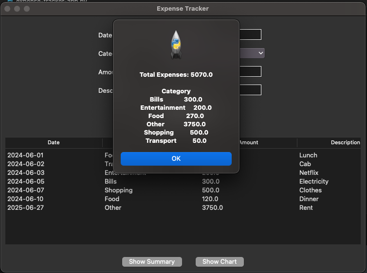
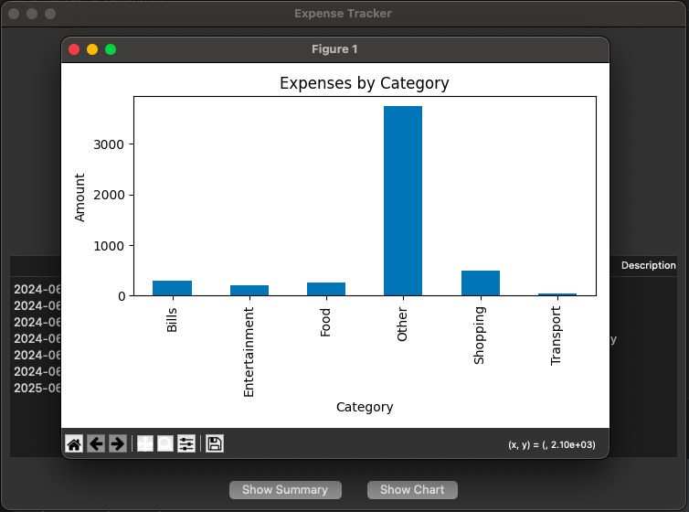

# 💰 Expense Tracker (Tkinter)

A simple desktop **Expense Tracker** built with **Python (Tkinter, Pandas, Matplotlib)**.  
Easily add, view, and analyze your expenses with a clean GUI.  

---

## ✨ Features
- 📅 **Add expenses** with date, category, amount, and description  
- 📋 **View all expenses** in a sortable table  
- 📊 **Summary report**: total expenses + breakdown by category  
- 📈 **Charts**: visualize expenses by category with Matplotlib  
- 💾 **Persistent storage**: expenses saved to `expenses.csv`  

---

## 🛠️ Requirements
- Python 3.8+  
- The following libraries:  
pandas
matplotlib

## 🚀 How to Run

Clone this repo:
git clone https://github.com/RishiSrivastava17/expense-tracker.git
cd expense-tracker

Run the app:
python expense_tracker.py

The Tkinter GUI window will open 🎉

## 📂 Project Structure
expense-tracker/
│── expense_tracker.py   # Main Tkinter app
│── expenses.csv         # Data file (auto-created if missing)
│── requirements.txt     # Dependencies
│── README.md            # Project documentation

## 📸 Screenshots

## 📜 License
This project is licensed under the MIT License – free to use and modify.
